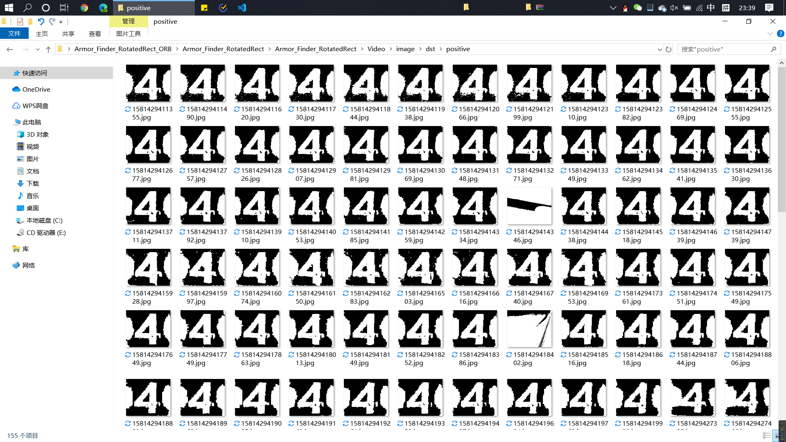

# 基于ORB的双级联分类器技术报告-韩煦源

## 一、现有分类器的主要缺陷

### 1. 这里的“现有分类器”指的是刘佳伟给我们讲的，我也进行了一些修改：

> 采用指针的方式遍历装甲板模板和输入分类器的图像（已灰度+二值化）对gain值进行加减累计：  
> uchar* p_src_grey = src_grey.ptr<uchar>(i)

|分类|gain|
|-|-|
|对应像素点同为255|gain+=3|
|对应像素点不同|gain-=2|
|对应像素点同为0|gain保持不变|

### 2. 这种分类器的优点是速度快，但是缺点很明显：过于简单、准确度低，难以判断所匹配的两灯条是否属于同一块装甲板

#### 【1】经常将同一辆车上属于不同装甲板的两个灯条匹配在一起，如：


#### 【2】或是将属于不同车的灯条匹配在一起，如：


## 二、基于ORB的双级联分类器

### 1. 针对现有分类器缺点的解决方案

> - 将现有分类器作为第一级分类器进行粗分,初步计算出进入分类器的图片对应的装甲板数字  
> - 同时将基于ORB特征识别算法的分类器作为第二级分类器进行细分  
> - 第二级分类器对第一级分类器的结果进行检查，二次筛选掉不符合要求的分类结果

### 2. 采用双级联分类器的原因

> 【1】 基于ORB特征检测的分类器可以达到很高的识别精度，但是其运算速度较慢
>> - 对于120*100的图像可以达到很好的识别效果，但是每幅图像的运算时间大约在1~2ms  
>> - 若将ORB分类器作为第一级分类器使用，则通过遍历已有模板图像的特征值比较输入分类器的图像属于哪一个数字的装甲板需要消耗15+ms的时间，即使结果精确，但非常耗时  

> 【2】双级联分类器既可充分利用现有分类器识别速度快的特点，又不失ORB分类器准确度高的优势
>> - 若将一级分类器识别结果导入二级ORB分类器，则ORB分类器仅需对此一幅图片进行特征识别运算，减少了程序运行时间

## 三、ORB分类器代码实现

### 1. 一级分类器头文件

```C++
#pragma once

#include <string>
#include <vector>
#include <utility>
#include <iostream>
#include <fstream>
#include <algorithm>
#include <opencv2/opencv.hpp>
#include "proportion_thresh.hpp"
#include <chrono>
# include "../../../../other/include/timer.hpp"

namespace sp //使用命名空间sp
{
bool ORB_classifier_isok(const cv::Mat& img2);

int classifier(const cv::Mat& src, std::string template_filename_list) 
//src是从原图中截取mat，template_filename_list是储存模板文件文件名文件
{
	#ifdef PRINT_CLASSIFIER_RUNTIME
    sp::timer timer_classifier; //建立计时器
    timer_classifier.reset(); // 开始计时
	#endif

	// 预处理截取图像
	#ifdef DEBUG_CLASSIFIER
	std::cout << " " << std::endl;
	std::cout << "开始分类" << std::endl;
	#endif

    cv::cvtColor(src, src, CV_RGB2HSV); //转换为HSV
		
	#ifdef SHOW_CLASSIFIER_IMAGE
	cv::imshow("SHOW_CLASSIFIER_IMAGE_HSV", src);
	#endif

	double thresh_binar = 0.85; //二值化取thresh_binar最亮部分

	#ifdef DEBUG_CLASSIFIER
	std::cout << " " << std::endl;
	std::cout << "设定二值化阈值成功" << std::endl;
	#endif

	cv::Mat src_grey;
	cv::cvtColor(src, src_grey, CV_RGB2GRAY); //转化截取图像为灰度

	#ifdef DEBUG_CLASSIFIER
	std::cout << " " << std::endl;
	std::cout << "灰度截取图像成功" << std::endl;
	#endif

	sp::proportion_thresh(src_grey, src_grey, 255, thresh_binar); //二值化截取图像

	#ifdef DEBUG_CLASSIFIER
	std::cout << " " << std::endl;
	std::cout << "二值化截取图像成功" << std::endl;
	#endif

	#ifdef SHOW_ARMOR_IMAGE
	cv::imshow("src_grey",src_grey);
	#endif
	
	int rows = src_grey.rows;
	int cols = src_grey.cols;

	rows = CLASSIFIER_IMAGEPART_ROWS;
	cols = CLASSIFIER_IMAGEPART_COLS;

	cv::resize(src_grey, src_grey, cv::Size(cols, rows), (0,0), (0,0), CV_INTER_AREA);

	#ifdef SHOW_CLASSIFIER_IMAGE
	cv::imshow("SHOW_CLASSIFIER_IMAGE_GREY", src_grey);
	#endif

	// 读入模板图像文件
	std::ifstream template_filename_in(template_filename_list); //读入模板图像文件名文件
	std::string template_filename;
	
	int gain = 0; //初始化gain
	std::vector<int> gain_list; //声明容器gain_list来放置每个图像的gain
	int count_armor = 1;

	while(getline(template_filename_in, template_filename))
	{
		// 模板图像预处理
		cv::Mat template_image = cv::imread(template_filename); //读入模板图像

		cv::Mat template_image_grey;
		cv::cvtColor(template_image, template_image_grey, CV_RGB2GRAY); //灰度模板图像
		sp::proportion_thresh(template_image_grey, template_image_grey, 255, thresh_binar); //二值化模板图像

		// 将模板图像的大小变成CLASSIFIER_IMAGEPART_COLS*CLASSIFIER_IMAGEPART_ROWS
		cv::resize(template_image_grey, template_image_grey, cv::Size(cols, rows), (0,0), (0,0), CV_INTER_AREA);
		
		#ifdef DEBUG_CLASSIFIER
		std::cout << "读入" << count_armor << "号装甲板模板" << std::endl;
		#endif

		// 逐像素获取每个像素的gain并累积
		for(int i=0; i<rows; i++)
		{
			//获取第i行首像素指针
			uchar* p_template_image_grey = template_image_grey.ptr<uchar>(i);
			uchar* p_src_grey = src_grey.ptr<uchar>(i);

			//对第i行的每个像素（Byte）进行操作
			for(int j=0; j<cols; j++)
			{
				//这是用指针访问像素的方法（速度快）
				if(p_template_image_grey[j]==255 
				&& p_src_grey[j]==255)
				{
					gain += 3;
				}
				else if(p_template_image_grey[j]
				 != p_src_grey[j])
				{
					gain -= 2;
				}
				else{}
			

				// // 这是用.at()函数的代码（速度慢）
				// if(template_image_grey.at<uchar>(i,j)==255 && src_grey.at<uchar>(i,j)==255)
				// {
				// 	gain += 3;
				// }
				// else if(template_image_grey.at<uchar>(i,j) != src_grey.at<uchar>(i,j))
				// {
				// 	gain -= 2;
				// }
				// else{}
			}
		}
		gain_list.push_back(gain); //将gain加入gain_list

		#ifdef DEBUG_CLASSIFIER
		std::cout << count_armor << "号装甲板的gain是" << gain << std::endl; //显示gain
		#endif

		gain = 0; //重置gain
		count_armor++;
	}

	auto min = std::min_element(gain_list.begin(), gain_list.end());
	auto max = std::max_element(gain_list.begin(), gain_list.end());

	#ifdef DEBUG_CLASSIFIER
	std::cout << "这组图像的最小gain是" << *min << std::endl;
	std::cout << "这组图像的最大gain是" << *max << std::endl;
	#endif

	std::string filePath;
	filePath.clear();

	sp::timer timer_now;
	long long int count_classifier_int(timer_now.getTimeStamp());
	std::string count_classifier_str = std::to_string(count_classifier_int);

	if(*max<1000)
	{
		#ifdef DEBUG_CLASSIFIER
		std::cout << "舍弃" << std::endl;
		#endif

		#ifdef CLASSIFIER_OUTPUT
		filePath = "../Video/image/dst/negative/negative_1_"+count_classifier_str+".jpg";
		cv::imwrite(filePath, src_grey);

		#ifdef DEBUG_CLASSIFIER
		std::cout << "输出negative图片成功" << std::endl;
		#endif

		#endif

		#ifdef PRINT_CLASSIFIER_RUNTIME
	    std::cout << "> 一级分类器运行时间：" << timer_classifier.get() << "ms" << std::endl; //结束计时
		#endif

		return 0;
	}
	else
	{
		int maxGainArmor = (max_element(gain_list.begin(),gain_list.end()) - gain_list.begin()) + 1;

		#ifdef DEBUG_PRINT_ARMORNUM
		std::cout << "对应编号为" << maxGainArmor << "的装甲板" << std::endl;
		#endif

		#ifdef PRINT_CLASSIFIER_RUNTIME
	    std::cout << "> 一级分类器运行时间：" << timer_classifier.get() << "ms" << std::endl; //结束计时
		#endif

		if(ORB_classifier_isok(src_grey) //使用ORB分类器
		)
		{
			#ifdef DEBUG_CLASSIFIER_ORB
		    std::cout << "> 一级分类器接受到ORB返回的true" << std::endl; 
			#endif

			#ifdef CLASSIFIER_OUTPUT
			filePath = "../Video/image/dst/positive/positive_"+count_classifier_str+".jpg";
			cv::imwrite(filePath, src_grey);
			#ifdef DEBUG_CLASSIFIER
			std::cout << "输出positive图片成功" << std::endl;
			#endif
			#endif

			return maxGainArmor;
		}
		else
		{
			#ifdef CLASSIFIER_OUTPUT
			filePath = "../Video/image/dst/negative/negative_2_"+count_classifier_str+".jpg";
			cv::imwrite(filePath, src_grey);
			#ifdef DEBUG_CLASSIFIER
			std::cout << "输出negative图片成功" << std::endl;
			#endif
			#endif
			
			#ifdef DEBUG_CLASSIFIER_ORB
		    std::cout << "> 一级分类器接受到ORB返回的false" << std::endl; 
			#endif
			
			return 0;
		}
	}
}
}
```

### 2. 二级ORB分类器头文件
```C++
#pragma once

#include <opencv2/xfeatures2d.hpp>

#define DRAW_IMAGE_FEATURE_MATCH

namespace sp //使用命名空间sp
{
bool ORB_classifier_isok(const cv::Mat& img2)
{
    #ifdef PRINT_CLASSIFIER_RUNTIME
    sp::timer timer_classifier_orb; //建立计时器
    timer_classifier_orb.reset(); // 开始计时
	#endif

    try
    { 
    //【1】载入原图片并显示+载入的图像是二值化之后的图像
    //img1是模板图像，img2是待检测图
    cv::Mat img1 = cv::imread("../Video/image/src/armor/T4.jpg",0);
    if(!img1.data||!img2.data)//检测图片是否读取成功
    {
        std::cout<<"读取图片错误，请确定目录下是否存在该图片"<<std::endl;
    }
    // cv::medianBlur(img1, img1, 3); //中值滤波
    // cv::medianBlur(img2, img2, 3); //中值滤波

    //【2】定义需要用到的变量和类
    cv::Ptr<cv::ORB> detector = cv::ORB::create(200,1.2); //定义一个ORB特征检测类对象detector
    std::vector<cv::KeyPoint> keypoint_1, keypoint_2;//放置特征点
    cv::Mat descriptors_1, descriptors_2;

    //【3】调用detect函数检测出SURF特征关键点，保存在vector容器中
    detector->detectAndCompute(img1,cv::Mat(),keypoint_1,descriptors_1);
    detector->detectAndCompute(img2,cv::Mat(),keypoint_2,descriptors_2);
    
    #ifdef DEBUG_CLASSIFIER_ORB
    if(!descriptors_1.data)
    {
        std::cout<<"> descriptors_1无内容"<<std::endl;
    }
    if (!descriptors_2.data)
    {
        std::cout<<"> descriptors_2无内容"<<std::endl;
    }
    #endif
    
    //【4】基于FLANN的描述符对象匹配
    std::vector<cv::DMatch> matches;
    // 初始化flann匹配
    cv::flann::Index flannIndex(descriptors_1, cv::flann::LshIndexParams(12,20,2), cvflann::FLANN_DIST_HAMMING);

    //【5】匹配和测试描述符，获取两个最邻近的描述符
    cv::Mat matchIndex(descriptors_1.rows, 2, CV_32SC1);
    cv::Mat matchDistance(descriptors_1.rows, 2, CV_32FC1);

    flannIndex.knnSearch(descriptors_2, matchIndex, matchDistance, 2, cv::flann::SearchParams());//调用K邻近算法

    //【6】根据劳氏算法(Low's algorithm)选出优秀的匹配
    std::vector<cv::DMatch> good_matches;
    for(int i=0;i<matchDistance.rows;i++)
    {
        if(matchDistance.at<float>(i,0) < 0.6*matchDistance.at<float>(i,1))
        {
            cv::DMatch dmatches(i, matchIndex.at<int>(i,0), matchDistance.at<float>(i,0));
            good_matches.push_back(dmatches);
        }
    }

    //【7】绘制并显示匹配窗口
    cv::Mat img_matches;
    cv::drawMatches(img2,keypoint_2,img1,keypoint_2,good_matches,img_matches);

    // 【8】输出相关匹配点信息
    for(int i=0;i<good_matches.size();i++)
    {
        std::cout<<"> 符合条件的匹配点 "<<i<<" 特征点1："<<good_matches[i].queryIdx<<" -- 特征点2："<<good_matches[i].trainIdx<<std::endl;
    }
    
    // 【9】打印特征信息
    std::cout<<"> img1检测到特征点"<<keypoint_1.size()<<"个"<<std::endl;
    std::cout<<"> img2检测到特征点"<<keypoint_2.size()<<"个"<<std::endl;
    #ifdef DEBUG_CLASSIFIER_ORB
    std::cout<<"> 共匹配到特征点"<<good_matches.size()<<"对"<<std::endl;
    #endif

    //【10】绘制特征图像
    #ifdef DRAW_IMAGE_FEATURE_MATCH
    cv::Mat img1_keypoint, img2_keypoint;
    cv::drawKeypoints(img1,keypoint_1,img1_keypoint);
    cv::drawKeypoints(img2,keypoint_2,img2_keypoint);
    cv::imshow("> 特征点检测效果图1",img1_keypoint);
    cv::imshow("> 特征点检测效果图2",img2_keypoint);
    cv::imshow("匹配效果图",img_matches);
    // cv::waitKey(0);
    #endif

    if(good_matches.size()>1)
    {
        #ifdef PRINT_CLASSIFIER_RUNTIME
	    std::cout << "> 二级分类器运行时间：" << timer_classifier_orb.get() << "ms" << std::endl; //结束计时
		#endif

        return true;
    }
    else
    {
        #ifdef PRINT_CLASSIFIER_RUNTIME
	    std::cout << "> 二级分类器运行时间：" << timer_classifier_orb.get() << "ms" << std::endl; //结束计时
		#endif
        
        return false;
    }
    

    }
    catch (std::exception& e) 
    {
        #ifdef PRINT_CLASSIFIER_RUNTIME
	    std::cout << "> 二级分类器运行时间：" << timer_classifier_orb.get() << "ms" << std::endl; //结束计时
		#endif

        #ifdef DEBUG_CLASSIFIER_ORB
        // std::cout << "> ORB分类器出错:" << std::endl; 
        std::cout << "> ORB分类器出错:" << std::endl <<"> Standard exception: " << std::endl << e.what() << std::endl; 
        std::cout << "> ORB返回false" << std::endl;
        #endif

        return false;
    } 
}
}
```

## 四、双级联分类器运行结果

### 1. 识别精度

#### 【1】positive结果

> 如图所示，在15秒视频识别出的155个positive结果中只有5个属于误识别  
> - 即双级联ORB分类器的识别精度约为96.8%


.png)
.png)

#### 【2】negative结果

> 如图所示，negative结果中输出的基本都是负相关分类器截图
> - 但是negative结果中也输出了一些不清楚的装甲板截图
> - 其原因在于此视频录制采用的曝光过低，装甲板上的数字显示得非常模糊，输入ORB分类器的数字残缺不全，导致特征识别出现问题，待回学校后新录视频再做检测

.png)
.png)
.png)
.png)
.png)

#### 【3】运行截图

> 由图像可见，前面在“一、现有分类器的主要缺陷”提到的各种问题已经被避免


### 2. 识别速度

> 由图可见，一级分类器运行时间约为4ms，二级分类器运行时间约为2ms，每帧程序运行时间约为40ms


## 五、总结

> 综上所述，基于ORB的双级联分类器可以达到很高的识别精度和较快的运算速度
> 程序中还有一些参数要在实际中调节，以达到更好的效果
