# Armor_Finder

### This repository contains codes for Roboter Armor Plate Identification Program in the DJI Robomaster Robotics Competition

| Author   |  Responsible part |
| ------ | -------------- |
| Xuyuan Han | Armor Plate Recognition and Classifier |
| Xiankun Zeng | PNP Ranging |

- In this program the Identification of Roboter Armor Plate will be achieved by using OpenCV to implement functions, such as image processing and image classifier.

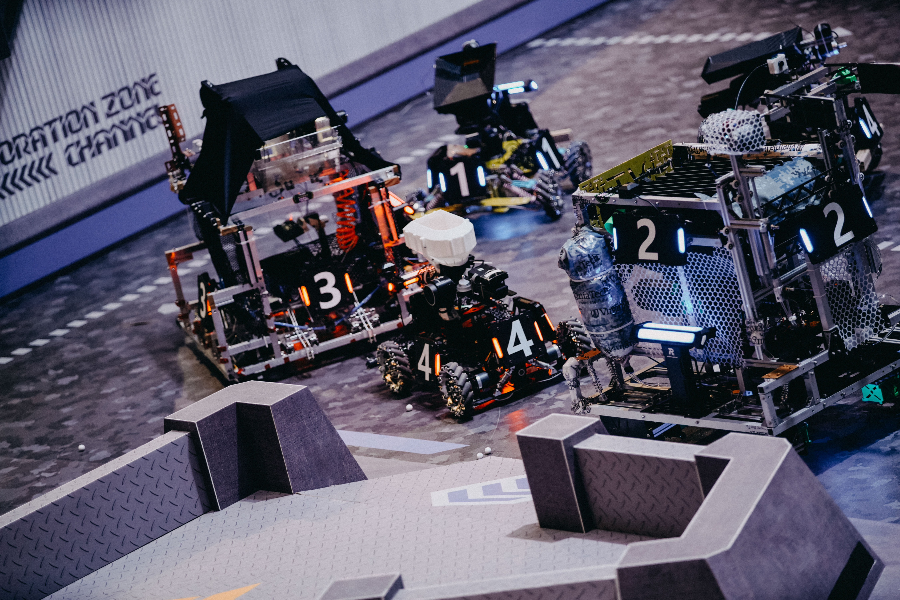

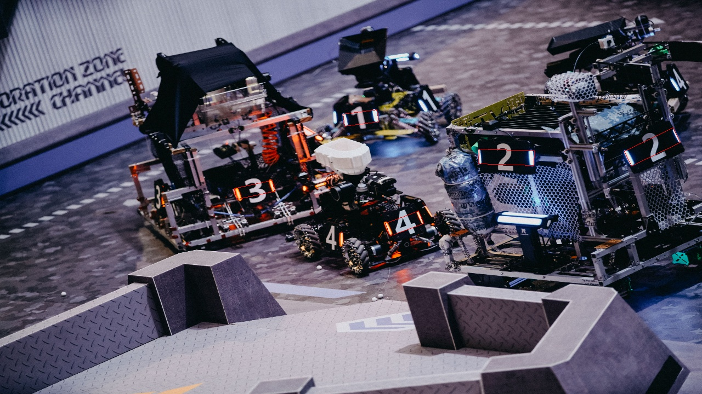

## 1. Environment

|Operating System|Runtime Library|
|-------|--------|
|Ubuntu16.04<br />Windows WSL|OpenCV 3.4.7<br />cmake 3.15.4|

- The images with size of **640×480** are used for image processing.

## 2. Program Compilation and Running

Ubuntu16.04（under the project folder）

```shell
mkdir build
cd build
cmake ..
make
sudo ./main
```

## 3. Files Structure

``` Files Structure
.
├── armor                   // main code of auto-aiming
│   ├── include             // auto-aiming header files
│   └── src                 // auto-aiming source code
├── CMakeLists.txt          // cmake project files
├── image                   // the image used by the test code
│   ├── dst                 // the original image
│   └── src                 // the image after process
├── main.cpp                // main.cpp
├── other                   // some other codes, such as timer, drawText
│   └── include             // other header files
├── README.md               // 
└── Video                   // the video files used for debugging the code and the screenshots of the classifier output
```

## 4. Operation Process of the Armor Plate Identification Program

- First perform hsv binarization on the image: assign the pixels that match the hsv color of the armor plate light bar to white, and assign other pixels to black, and use median filtering to make the image smooth
- Use edge extraction to obtain a rotating rectangular area that may be a light bar
- Filter out the light bar rectangle according to the aspect ratio of the rotated rectangle and the hsv brightness of the pixels of the rotated rectangle corresponding to the original image area
- Perform pairwise matching of all possible light bars, and filter according to the angle between the two light bars, the height ratio of the two light bars, the height difference between the centers of the two light bars, and the ratio of the distance between the centers of the two light bars aiiind the height of the light bars. Then we get the qualified light bar pairs.
- Extend the four outer vertices of the light bar pair up and down to the edge of the armor plate in proportion to get the armor plate quadrilateral
- Perform affine transformation on the screenshot of the quadrilateral area of the armor plate to obtain the armor plate image and submit it to the classifier to determine the armor plate and its ID
- Finally, put the framed armor plate quadrilateral into PNP to calculate the distance and angle


## 5. code naming conventions

- Function name: use the camel case nomenclature with the first letter lowercase
- Type name: use the camel case nomenclature with the first letter capitalized
- Variable name: use underscore separating  nomenclature

# ORB-Based Dual Cascade Classifier

## 1. Main defects of existing classifiers

> Using pointers to traverse the armor plate template and the image of the input classifier (grayscaled + binarized) to increase or decrease the gain value  
> uchar* p_src_grey = src_grey.ptr<uchar>(i)

| Category           | gain         |
| ----------------- | ------------ |
| Corresponding pixels are the same as 255 | gain+=3      |
| Corresponding pixels are different    | gain-=2      |
| Corresponding pixels are the same as 0   | gain remains unchanged |

- The advantage of this classifier is fast, but the disadvantages are obvious: too simple and low accuracy, it is difficult to judge whether the two matched light bars belong to the same armor plate

  - Often match two light bars belonging to different armor plates on the same car, such as:

  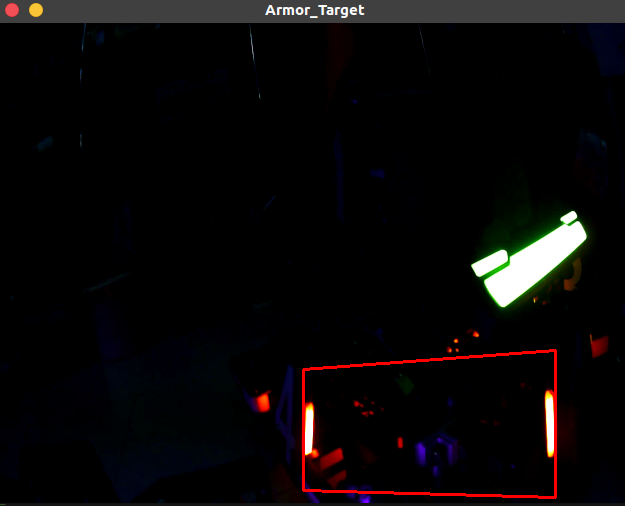

  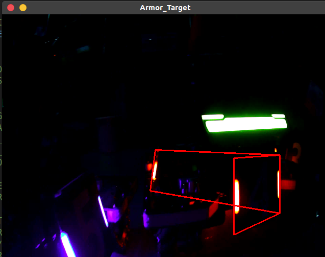

  - Or match light bars belonging to different cars together, such as:

  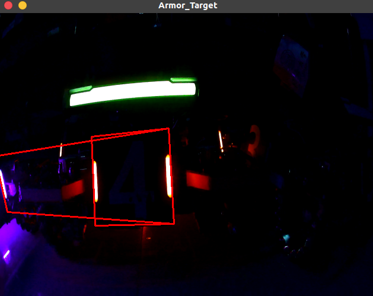

  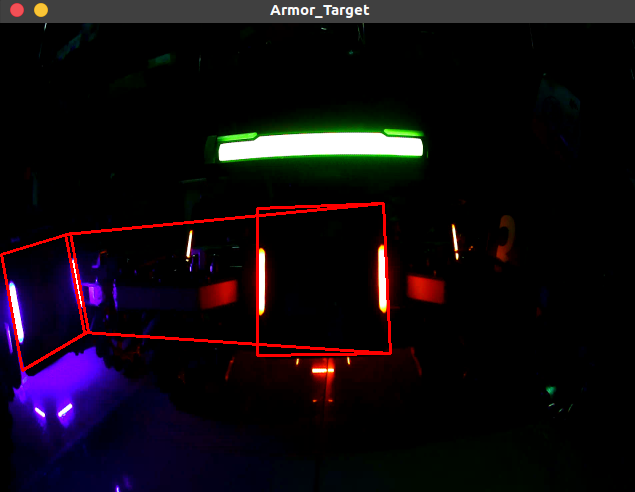

  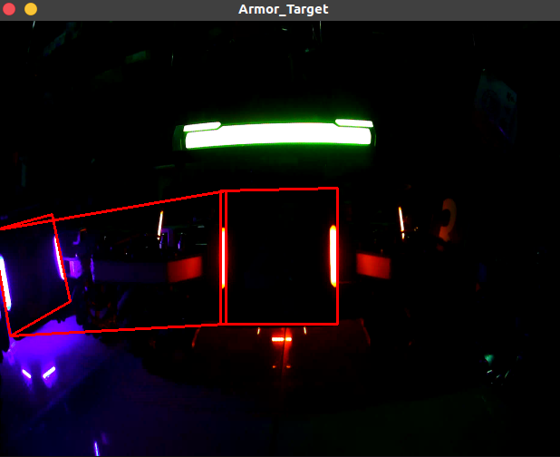
  
## 2. ORB-based Dual Cascade Classifier

### 1) Solutions to the shortcomings of existing classifiers

- Use the existing classifier as the first-level classifier for rough classification, and initially calculate the number of armor plates corresponding to the picture entering the classifier
- At the same time, the classifier based on the ORB feature recognition algorithm is used as the second-level classifier for subdivision
- The second-level classifier checks the results of the first-level classifier, and secondly filters out the classification results that do not meet the requirements

### 2) Reasons for adopting dual cascade classifier

- The classifier based on ORB feature detection can achieve high recognition accuracy, but its operation speed is slow
  - For 120*100 images, a good recognition effect can be achieved, but the calculation time for each image is about 1~2ms
  - If the ORB classifier is used as the first-level classifier, it will take 15+ms to compare which number of armor plates the image entered into the classifier belongs to by traversing the feature values ​​of the existing template image, even if the result is accurate , But very time-consuming

- The dual cascade classifier can not only make full use of the fast recognition speed of the existing classifier, but also does not lose the advantage of the high accuracy of the ORB classifier
  - If the recognition result of the first-level classifier is imported into the second-level ORB classifier, the ORB classifier only needs to perform feature recognition operations on this picture, which reduces the program running time

## 3. ORB classifier code implementation

### 1) The first-level classifier header file

```C++
#pragma once

#include <string>
#include <vector>
#include <utility>
#include <iostream>
#include <fstream>
#include <algorithm>
#include <opencv2/opencv.hpp>
#include "proportion_thresh.hpp"
#include <chrono>
# include "../../../../other/include/timer.hpp"

namespace sp //Use the namespace sp
{
bool ORB_classifier_isok(const cv::Mat& img2);

int classifier(const cv::Mat& src, std::string template_filename_list) 
//src is to intercept mat from the original image, template_filename_list is to store the file name of the template file
{
	#ifdef PRINT_CLASSIFIER_RUNTIME
    sp::timer timer_classifier; //Create timer
    timer_classifier.reset(); // start timing
	#endif

	// preprocess the captured image
	#ifdef DEBUG_CLASSIFIER
	std::cout << " " << std::endl;
	std::cout << "Start Classification" << std::endl;
	#endif

    cv::cvtColor(src, src, CV_RGB2HSV); //Convert to HSV
		
	#ifdef SHOW_CLASSIFIER_IMAGE
	cv::imshow("SHOW_CLASSIFIER_IMAGE_HSV", src);
	#endif

	double thresh_binar = 0.85; //Binarize and take the brightest part of thresh_binar

	#ifdef DEBUG_CLASSIFIER
	std::cout << " " << std::endl;
	std::cout << "Successfully set the binarization threshold" << std::endl;
	#endif

	cv::Mat src_grey;
	cv::cvtColor(src, src_grey, CV_RGB2GRAY); //Convert the captured image to grayscale

	#ifdef DEBUG_CLASSIFIER
	std::cout << " " << std::endl;
	std::cout << "Successfully captured the grayscale image" << std::endl;
	#endif

	sp::proportion_thresh(src_grey, src_grey, 255, thresh_binar); //binarize the captured image

	#ifdef DEBUG_CLASSIFIER
	std::cout << " " << std::endl;
	std::cout << "Successfully captured the binarized image" << std::endl;
	#endif

	#ifdef SHOW_ARMOR_IMAGE
	cv::imshow("src_grey",src_grey);
	#endif
	
	int rows = src_grey.rows;
	int cols = src_grey.cols;

	rows = CLASSIFIER_IMAGEPART_ROWS;
	cols = CLASSIFIER_IMAGEPART_COLS;

	cv::resize(src_grey, src_grey, cv::Size(cols, rows), (0,0), (0,0), CV_INTER_AREA);

	#ifdef SHOW_CLASSIFIER_IMAGE
	cv::imshow("SHOW_CLASSIFIER_IMAGE_GREY", src_grey);
	#endif

	// read in template image file
	std::ifstream template_filename_in(template_filename_list); //Read in template image file name file
	std::string template_filename;
	
	int gain = 0; //initialize gain
	std::vector<int> gain_list; //Declare the container gain_list to place the gain of each image
	int count_armor = 1;

	while(getline(template_filename_in, template_filename))
	{
		// Template image preprocessing
		cv::Mat template_image = cv::imread(template_filename); //Read in template image

		cv::Mat template_image_grey;
		cv::cvtColor(template_image, template_image_grey, CV_RGB2GRAY); //Gray template image
		sp::proportion_thresh(template_image_grey, template_image_grey, 255, thresh_binar); //binarize template image

		// Change the size of the template image to CLASSIFIER_IMAGEPART_COLS*CLASSIFIER_IMAGEPART_ROWS
		cv::resize(template_image_grey, template_image_grey, cv::Size(cols, rows), (0,0), (0,0), CV_INTER_AREA);
		
		#ifdef DEBUG_CLASSIFIER
		std::cout << "input" << count_armor << "number of armor plate template" << std::endl;
		#endif

		// Get the gain of each pixel pixel by pixel and accumulate
		for(int i=0; i<rows; i++)
		{
			//Get the pointer of the first pixel of the i-th row
			uchar* p_template_image_grey = template_image_grey.ptr<uchar>(i);
			uchar* p_src_grey = src_grey.ptr<uchar>(i);

			//Operate each pixel (Byte) in the i-th row
			for(int j=0; j<cols; j++)
			{
				//This is the way to access pixels with pointers (fast)
				if(p_template_image_grey[j]==255 
				&& p_src_grey[j]==255)
				{
					gain += 3;
				}
				else if(p_template_image_grey[j]
				 != p_src_grey[j])
				{
					gain -= 2;
				}
				else{}
			

				// // This is the code using the .at() function (slow)
				// if(template_image_grey.at<uchar>(i,j)==255 && src_grey.at<uchar>(i,j)==255)
				// {
				// 	gain += 3;
				// }
				// else if(template_image_grey.at<uchar>(i,j) != src_grey.at<uchar>(i,j))
				// {
				// 	gain -= 2;
				// }
				// else{}
			}
		}
		gain_list.push_back(gain); //Add gain to gain_list

		#ifdef DEBUG_CLASSIFIER
		std::cout << count_armor << " armor plate gain is" << gain << std::endl; //Display gain
		#endif

		gain = 0; //reset gain
		count_armor++;
	}

	auto min = std::min_element(gain_list.begin(), gain_list.end());
	auto max = std::max_element(gain_list.begin(), gain_list.end());

	#ifdef DEBUG_CLASSIFIER
	std::cout << "The minimum gain of this group of images is" << *min << std::endl;
	std::cout << "The maximum gain of this group of images is" << *max << std::endl;
	#endif

	std::string filePath;
	filePath.clear();

	sp::timer timer_now;
	long long int count_classifier_int(timer_now.getTimeStamp());
	std::string count_classifier_str = std::to_string(count_classifier_int);

	if(*max<1000)
	{
		#ifdef DEBUG_CLASSIFIER
		std::cout << "Discard" << std::endl;
		#endif

		#ifdef CLASSIFIER_OUTPUT
		filePath = "../Video/image/dst/negative/negative_1_"+count_classifier_str+".jpg";
		cv::imwrite(filePath, src_grey);

		#ifdef DEBUG_CLASSIFIER
		std::cout << "Successfully output negative pictures" << std::endl;
		#endif

		#endif

		#ifdef PRINT_CLASSIFIER_RUNTIME
	    std::cout << "> First classifier running time: " << timer_classifier.get() << "ms" << std::endl; //End timing
		#endif

		return 0;
	}
	else
	{
		int maxGainArmor = (max_element(gain_list.begin(),gain_list.end()) - gain_list.begin()) + 1;

		#ifdef DEBUG_PRINT_ARMORNUM
		std::cout << "corresponding to the armor plate numbered" << maxGainArmor << std::endl;
		#endif

		#ifdef PRINT_CLASSIFIER_RUNTIME
	    std::cout << "> First classifier running time: " << timer_classifier.get() << "ms" << std::endl; //End timing
		#endif

		if(ORB_classifier_isok(src_grey) //Using ORB classifier
		)
		{
			#ifdef DEBUG_CLASSIFIER_ORB
		    std::cout << "> The first class classifier receives true returned by ORB" << std::endl; 
			#endif

			#ifdef CLASSIFIER_OUTPUT
			filePath = "../Video/image/dst/positive/positive_"+count_classifier_str+".jpg";
			cv::imwrite(filePath, src_grey);
			#ifdef DEBUG_CLASSIFIER
			std::cout << "Successfully output positive pictures" << std::endl;
			#endif
			#endif

			return maxGainArmor;
		}
		else
		{
			#ifdef CLASSIFIER_OUTPUT
			filePath = "../Video/image/dst/negative/negative_2_"+count_classifier_str+".jpg";
			cv::imwrite(filePath, src_grey);
			#ifdef DEBUG_CLASSIFIER
			std::cout << "Successfully output negative pictures" << std::endl;
			#endif
			#endif
			
			#ifdef DEBUG_CLASSIFIER_ORB
		    std::cout << "> The first class classifier receives false returned by ORB" << std::endl; 
			#endif
			
			return 0;
		}
	}
}
}
```

### 2) Secondary ORB classifier header file
```C++
#pragma once

#include <opencv2/xfeatures2d.hpp>

#define DRAW_IMAGE_FEATURE_MATCH

namespace sp //Using the namespace sp
{
bool ORB_classifier_isok(const cv::Mat& img2)
{
    #ifdef PRINT_CLASSIFIER_RUNTIME
    sp::timer timer_classifier_orb; //Create a timer
    timer_classifier_orb.reset(); // start timing
	#endif

    try
    { 
    //[1] Load the original picture and display + the loaded image is the image after binarization
    //img1 is the template image, img2 is the image to be tested
    cv::Mat img1 = cv::imread("../Video/image/src/armor/T4.jpg",0);
    if(!img1.data||!img2.data)//Check whether the image is read successfully
    {
        std::cout<<"Error reading picture, please make sure whether the picture exists in the directory"<<std::endl;
    }
    // cv::medianBlur(img1, img1, 3); //median filter
    // cv::medianBlur(img2, img2, 3); //median filter

    //[2] Define the variables and classes that need to be used
    cv::Ptr<cv::ORB> detector = cv::ORB::create(200,1.2); //Define an ORB feature detection class object detector
    std::vector<cv::KeyPoint> keypoint_1, keypoint_2;//Place feature points
    cv::Mat descriptors_1, descriptors_2;

    //[3] Call the detect function to detect the key points of SURF features and save them in the vector container
    detector->detectAndCompute(img1,cv::Mat(),keypoint_1,descriptors_1);
    detector->detectAndCompute(img2,cv::Mat(),keypoint_2,descriptors_2);
    
    #ifdef DEBUG_CLASSIFIER_ORB
    if(!descriptors_1.data)
    {
        std::cout<<"> descriptors_1 has no content"<<std::endl;
    }
    if (!descriptors_2.data)
    {
        std::cout<<"> descriptors_2 has no content"<<std::endl;
    }
    #endif
    
    //[4] FLANN-based descriptor object matching
    std::vector<cv::DMatch> matches;
    // Initialize flann matching
    cv::flann::Index flannIndex(descriptors_1, cv::flann::LshIndexParams(12,20,2), cvflann::FLANN_DIST_HAMMING);

    //[5] Match and test descriptors, get the two closest descriptors
    cv::Mat matchIndex(descriptors_1.rows, 2, CV_32SC1);
    cv::Mat matchDistance(descriptors_1.rows, 2, CV_32FC1);

    flannIndex.knnSearch(descriptors_2, matchIndex, matchDistance, 2, cv::flann::SearchParams());//K proximity algorithm

    //[6] Select an excellent match according to Low's algorithm
    std::vector<cv::DMatch> good_matches;
    for(int i=0;i<matchDistance.rows;i++)
    {
        if(matchDistance.at<float>(i,0) < 0.6*matchDistance.at<float>(i,1))
        {
            cv::DMatch dmatches(i, matchIndex.at<int>(i,0), matchDistance.at<float>(i,0));
            good_matches.push_back(dmatches);
        }
    }

    //[7] Draw and display the matching window
    cv::Mat img_matches;
    cv::drawMatches(img2,keypoint_2,img1,keypoint_2,good_matches,img_matches);

    // [8] Output related matching point information
    for(int i=0;i<good_matches.size();i++)
    {
        std::cout<<"> Eligible matching points "<<i<<" Feature point 1: "<<good_matches[i].queryIdx<<" -- Feature point 2: "<<good_matches[i].trainIdx<<std::endl;
    }
    
    // [9]Print feature information
    std::cout<<"> img1检测到特征点"<<keypoint_1.size()<<"个"<<std::endl;
    std::cout<<"> img2检测到特征点"<<keypoint_2.size()<<"个"<<std::endl;
    #ifdef DEBUG_CLASSIFIER_ORB
    std::cout<<"> 共匹配到特征点"<<good_matches.size()<<"对"<<std::endl;
    #endif

    //[10] Draw feature image
    #ifdef DRAW_IMAGE_FEATURE_MATCH
    cv::Mat img1_keypoint, img2_keypoint;
    cv::drawKeypoints(img1,keypoint_1,img1_keypoint);
    cv::drawKeypoints(img2,keypoint_2,img2_keypoint);
    cv::imshow("> Feature point detection result picture 1",img1_keypoint);
    cv::imshow("> Feature point detection result picture 2",img2_keypoint);
    cv::imshow("Matching result picture",img_matches);
    // cv::waitKey(0);
    #endif

    if(good_matches.size()>1)
    {
        #ifdef PRINT_CLASSIFIER_RUNTIME
	    std::cout << "> Secondary classifier running time: " << timer_classifier_orb.get() << "ms" << std::endl; //End timing
		#endif

        return true;
    }
    else
    {
        #ifdef PRINT_CLASSIFIER_RUNTIME
	    std::cout << "> Secondary classifier running time: " << timer_classifier_orb.get() << "ms" << std::endl; //End timing
		#endif
        
        return false;
    }
    

    }
    catch (std::exception& e) 
    {
        #ifdef PRINT_CLASSIFIER_RUNTIME
	    std::cout << "> Secondary classifier running time: " << timer_classifier_orb.get() << "ms" << std::endl; //End timing
		#endif

        #ifdef DEBUG_CLASSIFIER_ORB
        // std::cout << "> ORB classifier error: " << std::endl; 
        std::cout << "> ORB classifier error: " << std::endl <<"> Standard exception: " << std::endl << e.what() << std::endl; 
        std::cout << "> ORB returns false" << std::endl;
        #endif

        return false;
    } 
}
}
```

## 4. Running Results of the Dual Cascade Classifier

### 1) Recognition accuracy

#### [1] Positive result

> As shown in the figure, only 5 of the 155 positive results identified in the 15-second video are misidentified  
>
> - That is, the recognition accuracy of the dual cascade ORB classifier is about 96.8%

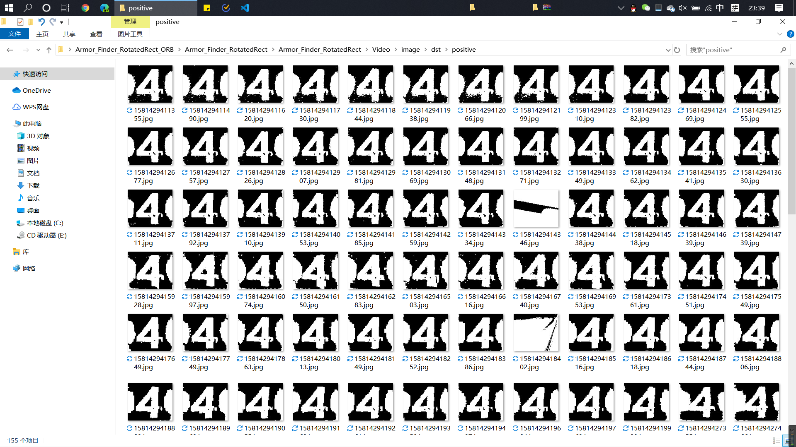

.png)

.png)

#### [2] Negative results

> As shown in the figure, the output in the negative result is basically screenshots of results of the negative correlation classifier
> - But some unclear screenshots of armor plates are also output in the negative results
> - The reason is that the exposure used in this video recording is too low, the numbers on the armor plate are displayed very vaguely, and the numbers input to the ORB classifier are incomplete, resulting in problems with feature recognition. After returning to school, the newly recorded video will be tested again

.png)

.png)

.png)

.png)

.png)

#### [3] Video Run Screenshot

> As can be seen from the image, the various problems mentioned in the previous section "I. Main defects of existing classifiers" have been avoided

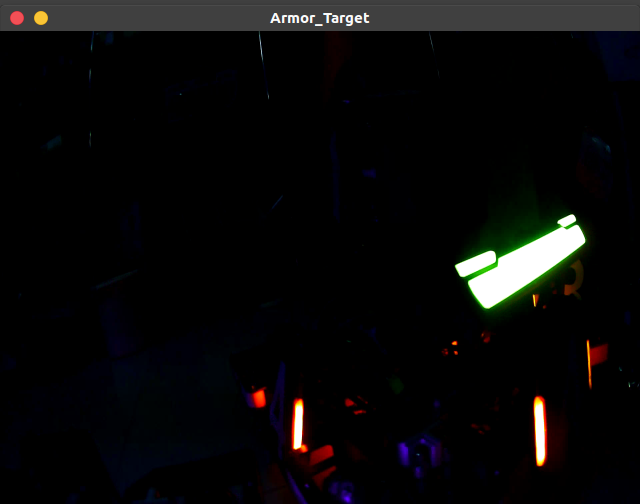

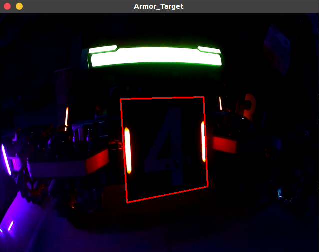

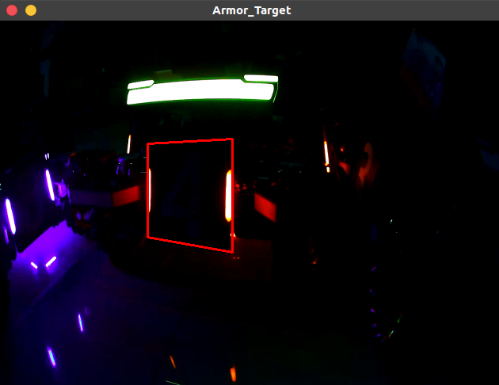

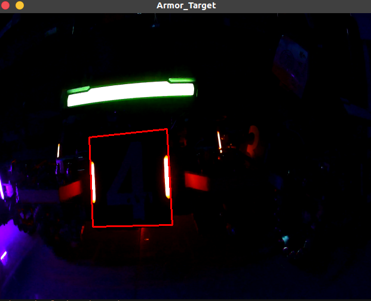

### 2) Recognition speed

> As can be seen from the figure, the running time of the first classifier is about 4ms, the running time of the second classifier is about 2ms, and the program running time per frame is about 40ms

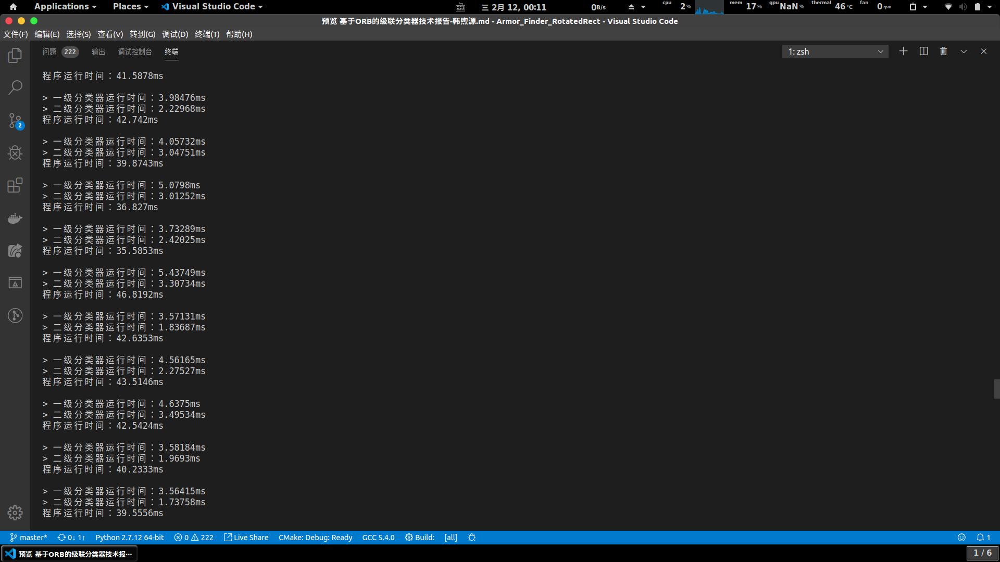

## 5. summary

In summary, the ORB-based dual-cascade classifier can achieve high recognition accuracy and faster calculation speed
There are some parameters in the program that need to be adjusted in practice to achieve better results.