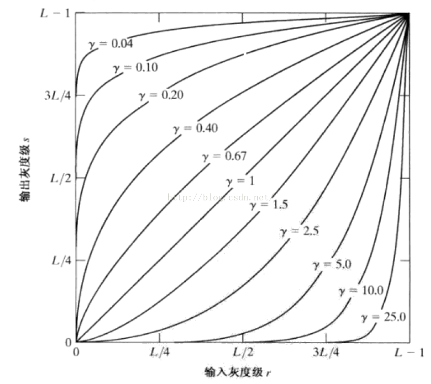

# 工业相机参数 大华A5131CU210

## 使能 & 曝光模式 & 曝光时间（3500-4500us）

|曝光模式|含义|
|:-|:-|
|Off|手动调节曝光时间（曝光量）|
|Once|单次设定曝光时间（不可手动调节)|
|Continuous|连续曝光时间（不可手动调节）|

- 当打开“使能”和“Once”后，先以自动模式调节调节曝光时间和帧率之间的关系，当曝光时间稳定1s左右停止调节曝光时间
- 当打开“使能”和“Continuous”后，曝光时间会自动与帧率成反比变化
- 曝光：曝光对照片质量的影响很大,如果曝光过度,则照片过亮,失去图像细节;如果曝光不足,则照片过暗,同样会失去图像细节
- 光圈：光圈控制光线进入的通路的大小,光圈越大,则单位时间的光通量越大,光圈越小,则单位时间的光通量越小
- 曝光时间：也就是快门速度，快门速度和光圈大小是互补的，相同曝光量的情况下提高快门速度需要增大光圈。
- 不过曝的前提下，增加曝光时间可以增加信噪比，使图像清晰。对于很弱的信号，曝光也不能无限增加，因为随着曝光时间增加，噪音也会积累。

## 增益（1~32）

- 【增益其实就是相机中的感光器件对光的灵敏度】
- 工业相机内有一个将来自 CCD 的信号放大到可以使用水准的视频放大器，其放大倍数即增益，等效于有较高的灵敏度，然而在亮光照的环境下放大器将过载，此时的噪点也会比较明显，使视频信号畸变。
- 在对图像信号进行放大的过程中同时也会放大噪声信号,通常把放大器增益设为最小。增益越小，噪点越小；增益越大，噪点越多，特别是在暗处。增益一般只是在信号弱，但不想增加曝光时间的情况下使用。

## 伽马（1~4）

- 伽马值是表示非线性元件输入与输出之间的关系
- 在图像处理中，将漂白(相机过曝)的图片或者过暗(曝光不足)的图片，进行修正
- 按幂函数对亮度值重新分布，伽玛就是指数。伽玛大于1使亮的更亮暗的更暗，可以抹掉一些弱信号；小于1则相反可以让较弱信号显示出来
- gamma值小于1时，会拉伸图像中灰度级较低的区域，同时会压缩灰度级较高的部分,提高图像对比度
- gamma值大于1时，会拉伸图像中灰度级较高的区域，同时会压缩灰度级较低的部分
- 

## 降噪(0~100)

- 噪点：主要是指CCD（CMOS）【CCD（电荷耦合器件）芯片和CMOS（互补金属氧化物半导体）芯片都将光线（光子）转换成电子信号（电子）。】将光线作为接收信号并输出的过程中所产生的图像中的粗糙部分，也指图像中不该出现的外来像素和伪色块，通常由电子干扰产生。是图像中一种亮度或颜色信息的随机变化(被拍摄物体本身并没有)，也就是图像上错误和额外的信息。可以说其原因是由于处理器无法处理较慢的快门速度所带来的巨大的工作量，致使一些特定的像素失去控制而造成的。
- 降噪功能是指针对噪点进行优化和消除的功能。如果使用降噪功能，在记录图像之前就会利用数字处理方法来消除图像噪音，因此在保存完毕以前就需要花费一点额外的时间。但随着降噪功能的开启，画面细节会损失。

## 锐度(0~100)

- 锐度指的是增加分割画面区域的边缘线周边的对比度，从而达到刻痕的效果，使得内容更加锐利。锐化仅会影响少部分边缘像素的对比度，整个画面并不会受到大量的影响
- 对比度：图像最亮和最暗之间的区域之间的比率，比值越大，从黑到白的渐变层次就越多，从而色彩表现越丰富。对比度对视觉效果的影响非常关键，一般来说对比度越大，图像越清晰醒目，色彩也越鲜明艳丽；而对比度小，则会让整个画面都灰蒙蒙的。高对比度对于图像的清晰度、细节表现、灰度层次表现都有很大帮助。对比度越高图像效果越好，色彩会更饱和，反之对比度低则画面会显得模糊，色彩也不鲜明。对比度指的是拉扯整个图像的曝光水平，让亮的地方更亮，暗的地方更暗

## 亮度(0~100;默认50)

- 调整图像亮度
- [学会理解相机中的亮度直方图，能够得到更加准确的曝光](http://baijiahao.baidu.com/s?id=1596739433503109140&wfr=spider&for=pc)

## 数字位移(0~4)

- 当物体表面产生变化后，体现在图像上的特征点的改变
- 利用相机拍摄变形前后被测物体表面的数字散斑图像，再通过匹配变形前后数字散斑图像中的对应图像子区获得被测物体表面点的位移
- 物体变形前后，其表面上的几何点的移动产生了位移，通过相关算法，确定物体变形前后对应的几何点，可以得到位移
- 在变形前后的图像上，各取大小为mxm的子区域，计算相关系数C，改变u，V的值，即在变形前后的图像上移动的子区域，可以得到不同的C值，使得C取得最大值的u和v，即是子区域中心的位移，该公式求得的是物体表面的整像素位移值c

## 白平衡

- 字面上的理解是白色的平衡，例如：在日光灯的房间里拍摄的影像会显得发绿，在室内钨丝灯光下拍摄出来的景物就会偏黄，而在日光阴影处拍摄到的照片则莫名其妙地偏蓝，其原因就在于白平衡的设置上
- 白平衡（White Balance)是彩色相机中采用的技术，白平衡是对红、绿、蓝三个分量的平衡，以使相机能反映实际景物真实颜色。由于光敏元件在不同的光照条件下RGB 三个分量的输出是不平衡的，从而会差生图像在色彩上的失真，偏蓝或者偏红，因此需要白平衡来还原图像的色彩

|自动白平衡-模式|功能|
|-|-|
|off|手动调节白平衡的RGB增益|
|once|先以自动模式调节白平衡，当RGB增益在两秒内无变化时停止自动调节白平衡|
|continous|始终自动调节白平衡|

## 参考资料

- [工业视觉 四 曝光与增益 、伽马、饱和度、对比度、锐度、黑电平](https://blog.csdn.net/qq_20848403/article/details/81198540)
- [工业相机 常用参数](https://blog.csdn.net/caojinpei123/article/details/100877401)
- [视觉工程师必须知道的工业相机50问，绝对干货！（转载）](https://www.cnblogs.com/fredliu/p/10030455.html)
- [相机曝光三要素的作用](http://ask.zol.com.cn/x/12708932.html)

## SimpleSample main.cpp

### 采图模式

-【连续】（CSystem::getInstance().createAcquisitionControl(cameraSptr)）
-【触发】（enumNode.setValueBySymbol("FrameStart")）
-【设置触发源】（enumNode.setValueBySymbol("Software")）
-【获取触发】（enumNode.getValueSymbol(strValue);）

### 传感器采样率（采集分辨率)

-【设置采样率】（CSystem::getInstance().createImageFormatControl(cameraSptr)）
-【获取采样率】（ sptrImageFormatControl->width();sptrImageFormatControl->height()）

### 设置bining(预测模型结果校准)

-将样本按估计值降序排序，均分为k个区间class,对于落在某个bin里的新样本，属于某个class的概率等于这个bin中这个class的实例所占的比例

### 获取分辨率

-【MaxWidth】（ptrParam->getValue(nWidthMax)）
-【MaxHeight】(ptrParam->getValue(nHeightMax))

### 图像ROI

-【获取 width&&height】(sptrImageFormatControl->width();sptrImageFormatControl->height())
-【设定区域】（sptrImageFormatControl->offsetX()；sptrImageFormatControl->offsetY()）
-【外部获取取样长宽】

### 设置曝光

-【手动曝光】(off:enumNode.setValueBySymbol("Off");)
-【自动曝光】(continous:enumNode.setValueBySymbol("Continuous"))
-【设置曝光时间】（doubleNode.setValue(dExposureTime)）
-【曝光范围】（曝光时间的最大/最小值）

### 增益值

-【设置增益值】（doubleNode.setValue(dGainRaw)）
-【获取增益值】（doubleNode.getValue(dGainRaw)）
-【增益值范围】

### 伽马值

-【设置伽马值】（doubleNode.setValue(dGamma)）
-【获取伽马值】（doubleNode.getValue(dGamma)）
-【伽马值范围】（doubleNode.getMinVal(dMinValue)；doubleNode.getMaxVal(dMaxValue)）

### 白平衡值

- 设置白平衡之前首先要关闭自动白平衡
- 白平衡有三个值对应RGB 重复操作三次！！！！！！！！
- 以“RED”为例
-【设置白平衡】（enumNode.setValueBySymbol("Red")）
-【获取白平衡】（doubleNode.getValue(dRedBalanceRatio)）
-【白平衡范围】

### 采图针率

- 设置
-【当前最大针率】（booleanNode.setValue(true)）
-【设置针率】（doubleNode.setValue(dFrameRate)）
-判断是否可以调整
-【获取针率】

### 保存参数/加载参数（外部输入）

### 外触延时时间

-信号传入到各个电路，完成参数的设定和启动需要一定时间
-【设置延时时间】（doubleNode.setValue(dDelayTime)）
-【获取延时时间】（doubleNode.getValue(dDelayTime)）

### 外触模式

-首先判断是否打开外触发，并且在LINE（光偶隔离输入）下
-上升延触发：电平/电信号由低变高触发
-下降延触发：电平/电信号由高变低触发
-以上升延触为例
-【设置模式】（enumNode.setValueBySymbol("RisingEdge")）
-【获取模式】（enumNode.getValueSymbol(strValue)）

### 外触发信号滤波时间

-先选择线程，再设置滤波时间
-【设置滤波时间】（enumNode.setValueBySymbol("Line1")；doubleNode.setValue(dLineDebouncerTimeAbs)）
-【获取滤波时间】（doubleNode.getValue(dLineDebouncerTimeAbs))）
-dLineDebouncerTimeAbs  线程启动时间

### 外部光源曝光时间

-外部光源造成的近似曝光的现象
-【设置时间】（paramLineSource.setValueBySymbol("UserOutput1")）
-将输出信号拉高再降低，消除影响
